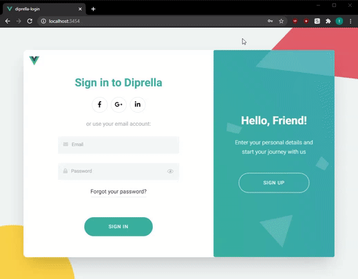

## CMS Custom Frontend Mockups
Projects that require teamwork between a designer and a developer. Here I'm working on realizing concepts efficiently and effectively.

## E-Commerce Shoe Store

[Designer (Saptarshi Prakash)](https://dribbble.com/shots/13819426-Parallax-Swipe-Mobile-UI-E-Commerce)

[Live-Demo (heroku.com)](https://fierce-island-96798.herokuapp.com)

[Repository](https://github.com/w-smesnoj/parallax-swipe)

A frontend project with flashy transition and parallax effects created in VueJS

--

## Login Form

[Designer (SELECTO)](https://dribbble.com/shots/5311359-Diprella-Login)

[Live-Demo (heroku.com)](https://diprella-login.herokuapp.com/)

[Repository](https://github.com/w-smesnoj/diprella-login)

A project with focus on web accessibility and semantics.

